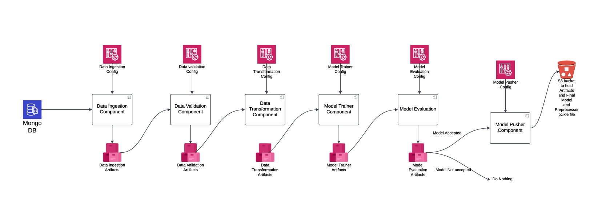
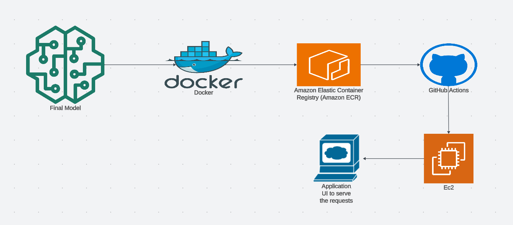
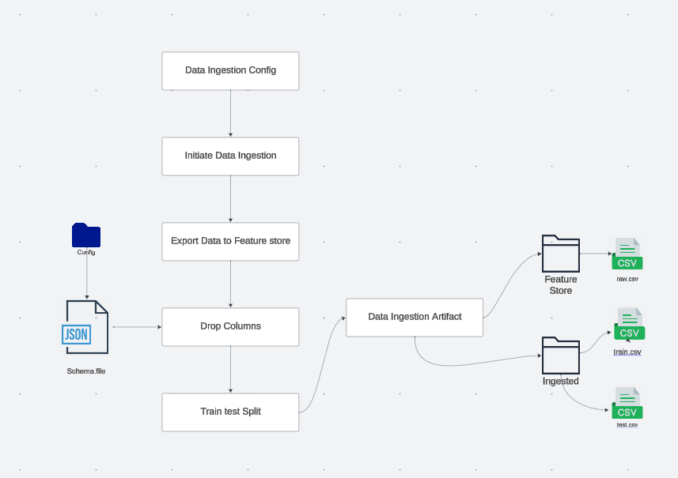
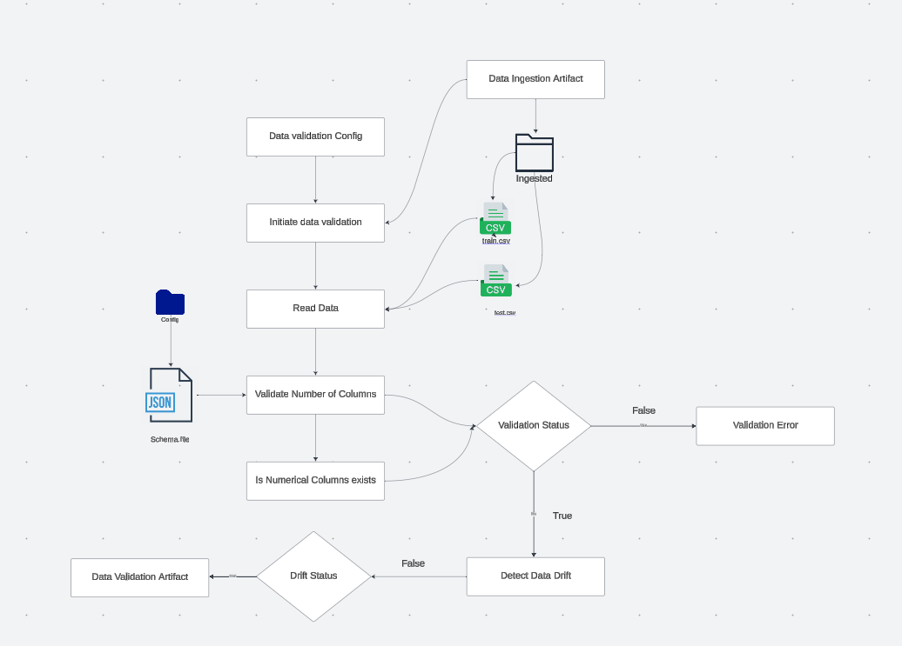

# networksecurity

Open sources tools Used:

- Language : Python
- Experiment Tracking: MLFlow
- Data Versioning: DVC and DagsHub
- Code Versioning: Git and GitHub
- Containerization: Docker
- Image Registry: Dockerhub and Aws ECR
- CI/CD Pipeline: GitHub actions
- Deployment: Amazon EC2
- Web UI: Streamlit
- Feature Store: Amazon S3 bucket
- ETL Pipeline : Airflow
- Database: MongoDB

ETL Pipeline Repository : https://github.com/VigneshwarKandhaiya1207/s3_mongo_data_pipeline_airflow.git


## Project Architecture



## Infrastructure Architecture



### Detailed Project Architecture 

#### Data Ingestion:




1. Ingest data from the MongoDB
   - Extract data from the `phishingdata` collection in MongoDB
   - Query for new records updated daily

#### Data Validation:



1. Ingest data from MongoDB (phishingdata collection)
2. Validate Data Against Schema:
   - Check for required columns and correct data types.
   - If validation fails, stop processing and log an error.
   - If validation passes, proceed to data drift check.
3. Check for Data Drift:
   - Compare statistical distributions of the data against the baseline.
   - Use drift detection tools or statistical tests.
   - If no drift detected, proceed to save the validation artifact.
   - If drift detected, trigger model retraining or adjustments.
4. Save Validation Artifact:
   - Save schema validation and data drift results to an artifacts directory.


#### Data Tansformation:

1. Missing Value Imputation:
   - Impute missing values in numerical and categorical columns.
     - Numerical data: Mean, median, or mode imputation.
     - Categorical data: Mode or placeholder imputation.

2. Scaling:
   - Apply scaling techniques (e.g., Standardization, Min-Max Scaling, Robust Scaling) to numerical features.

3. Final Processed Data
   - Data is now clean, scaled, and ready for training or storage.


#### Model Training:

1. Model Training:
   - Train multiple classification algorithms (Logistic Regression, Random Forest, SVC, XGBoost, etc.) on the transformed data.

2. Model Evaluation
   - Evaluate each model using cross-validation or a validation dataset.
   - Compute evaluation metrics, with an emphasis on the **F1 score** (which balances precision and recall).

3. Model Selection
   - Select the model with the highest F1 score as the best model.

4. Final Model
   - Save the best model (with highest F1 score) for deployment.

The final model and the preprocessor object is pushed to the AWS S3 bucket which can be used in the future for model prediction.

## Detailed Infrastructure Architecture

## High-Level CI/CD Pipeline Overview

## Trigger GitHub Actions Workflow on Commit:

Every time a new commit is pushed to the repository (e.g., to the main branch), GitHub Actions triggers the workflow.

## Build Docker Image:

The workflow builds a Docker image based on the application code in the repository. This step uses the Dockerfile in the repository to package the application and its dependencies.

## Push Docker Image to AWS ECR:

After building the Docker image, the image is tagged and pushed to the Amazon Elastic Container Registry (ECR). This allows you to store and manage Docker images in a scalable and secure registry.

## Deploy Image to EC2 Using Self-Hosted Runner:

Once the image is pushed to ECR, the workflow triggers the deployment of the image to an EC2 instance. This deployment is handled by a self-hosted GitHub Actions runner on the EC2 instance.
The self-hosted runner interacts with the EC2 instance to pull the Docker image from ECR and run the application.

### To replicate the project in localS

Step 1: Clone the repository

````
git clone https://github.com/VigneshwarKandhaiya1207/networksecurity.git
````

Step 2: Create a virtual environment

````
conda create -p venv python==3.10 -y
conda activate ./venv
````

Step 3: Install all the required packages

````
pip install -r requirements.txt
````

Step 4: Run the streamlit app

````
streamlit run app.py
````

The application listens on default port `8501`. 
Open the browser hit `http://127.0.0.1/8501`

